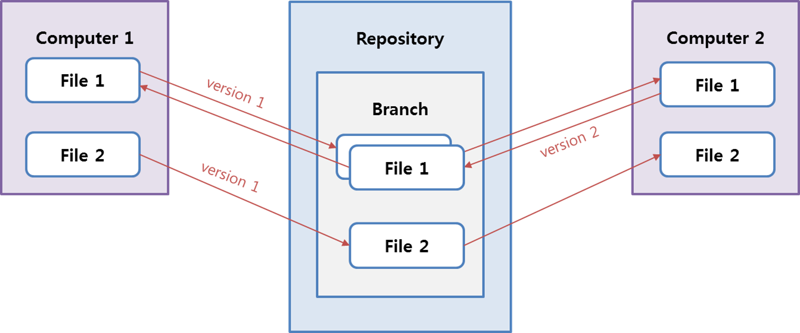
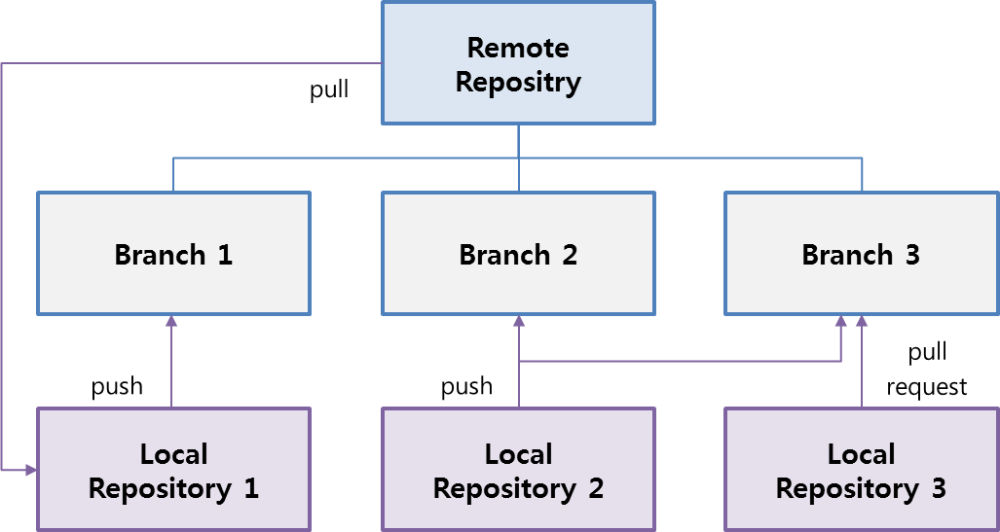
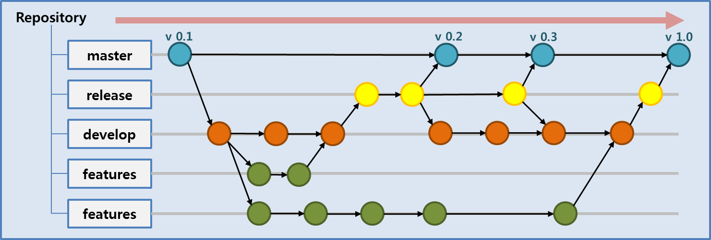

---?image=images/ssafy_main.png
@transition[slide]

## @color[black](Git and Markdown)
@snap[south docslink span-50]
Easy Way to Get Familiar With Git
@snapend

---?image=images/ssafy_bg.png

@snap
1. An Introduction to Git
2. How to Use
3. Slideshow with Git Pitch
4. Create Personal Blog

**Today's Mission**
Markdown Syntax Basic

---?image=images/ssafy_bg.png

1. An Introduction to Git

Git: Version Control System(VCS) developed by Linus Tovaldz, who was well-known for Linux developer.

---?image=images/ssafy_bg.png

* Purpose of Git
  - Fast
  - Simple Structure
  - Non-linear Development
  - Totally Separated
  - Large Project
  

 
---?image=images/ssafy_bg.png
 
* Pros of VCS
  - History of each files
  - Suitale for DevOps Cooperating development
   

 
---?image=images/ssafy_bg.png
 
2. How to Use
  * [Join GitHub and Create Repository](https://nugunacoding.github.io/Join-GitHub)
   
3. Slideshow with Git Pitch
  * [Join GitHub and Create Repository](https://nugunacoding.github.io/Join-GitHub)
  
4. Create Personal Blog
  * [Join GitHub and Create Repository](https://nugunacoding.github.io/Join-GitHub)
