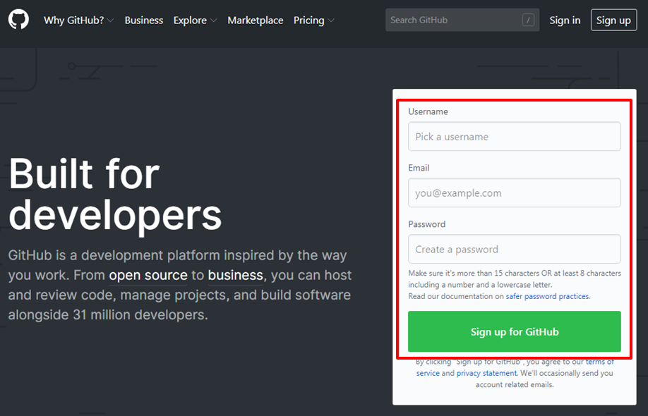
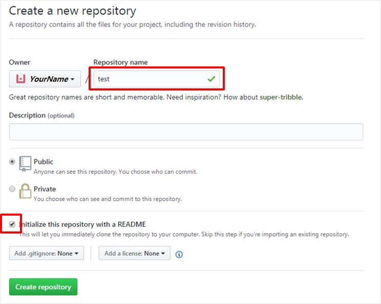
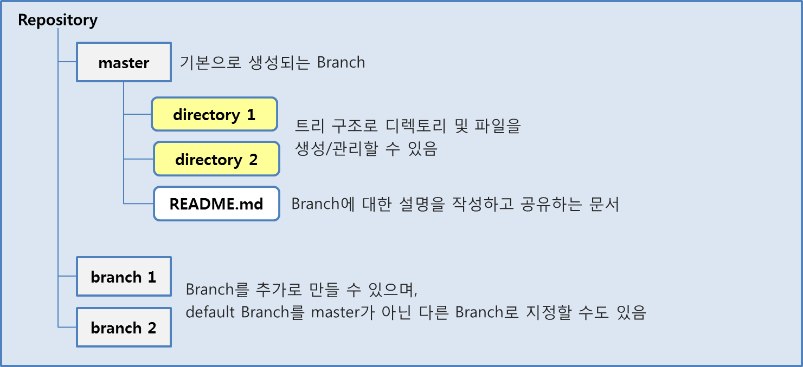
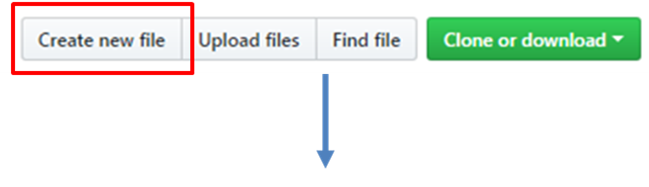
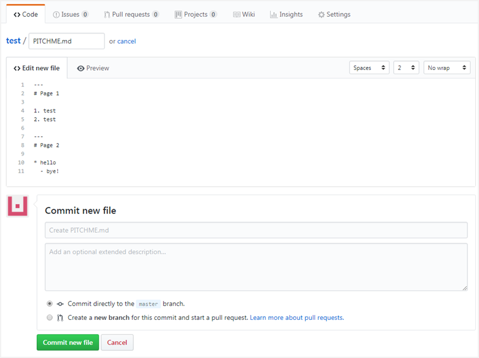
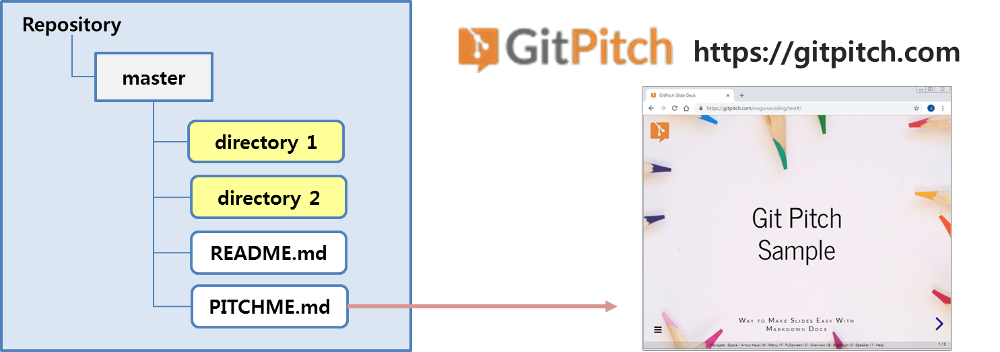

---?image=images/ssafy_main.png
@transition[slide]

## @color[black](Git and Markdown)
@snap[south docslink span-50]
Easy Way to Get Familiar With Git
@snapend

---?image=images/ssafy_bg.png

1. An Introduction to Git
2. How to Use
3. Easy Slide Show with Git Pitch
4. Make Personal Blog

Markdown Syntax Basic

---?image=images/ssafy_bg.png

1. An Introduction to Git

Git: Version Control System(VCS) developed by Linus Tovaldz, who was well-known for Linux developer.

---?image=images/ssafy_bg.png

* Purpose of Git
  - Fast
  - Simple Structure
  - Non-linear Development
  - Totally Separated
  - Large Project
  

 
 ---?image=images/ssafy_bg.png
 
 * Pros of VCS
   - History of each files
   - Suitale for DevOps Cooperating development
   

 
 ---?image=images/ssafy_bg.png
 
2. How to Use
 
* GitHub vs. GitLab
 
 |Features|GitHub|GitLab|
 |:--------:|:------:|:------:|
 |released|2008.04|2011.09|
 |free plans|public only|public and private|
 |issue tracking|yes|yes|
 |wiki|yes|yes|
 |web hosting|yes|yes|
 |popularity|more|less|
 
    - GitHub and GitLab has a similarity on their features.
    - Both repositories can be imported from the other.
 
---?image=images/ssafy_bg.png
 
  1. Join GitHub
     1. Open a web browser and go to https://github.com
     2. Fill the textboxes with your information.
       (Skip this step if you already have GitHub account)
       

---?image=images/ssafy_bg.png

     3. Select a plan on Step 2.
     4. You don't need to complete Step 3, just skip to the next.
     5. Open your mailbox and verify your email address.

---?image=images/ssafy_bg.png

  2. Create Repository
     1. Click [New repository] and set the name of your repository.
     2. Check the box for initializing with a README.md.
     3. Click [Create Repository] to proceed.
   

---?image=images/ssafy_bg.png

Now, you've done creating your repository.
README.md will be used to explain your project or whatever.

---?image=images/ssafy_bg.png

  3. Easy Slide Show with Git Pitch

Create a document as markdown style like README.md, but you should name this file PITCHME.md.

     1. Click [Crate new file].
     2. Fill PITCHME.md on the inputbox.
     3. Click [Commit new file]

---?image=images/ssafy_bg.png

You can read the file README.md on the GitHub Page, but it will be very useful when you open it on Git Pitch, which mautomatically renders slide show based on the markdown syntax.

Just type the address below on a web browser without any other process.
https://gitpitch/*YourName*/*Repository*/*Branch*
(Branch name can be omitted if it is master.

---?image=images/ssafy_bg.png

https://gitpitch.com/docs

